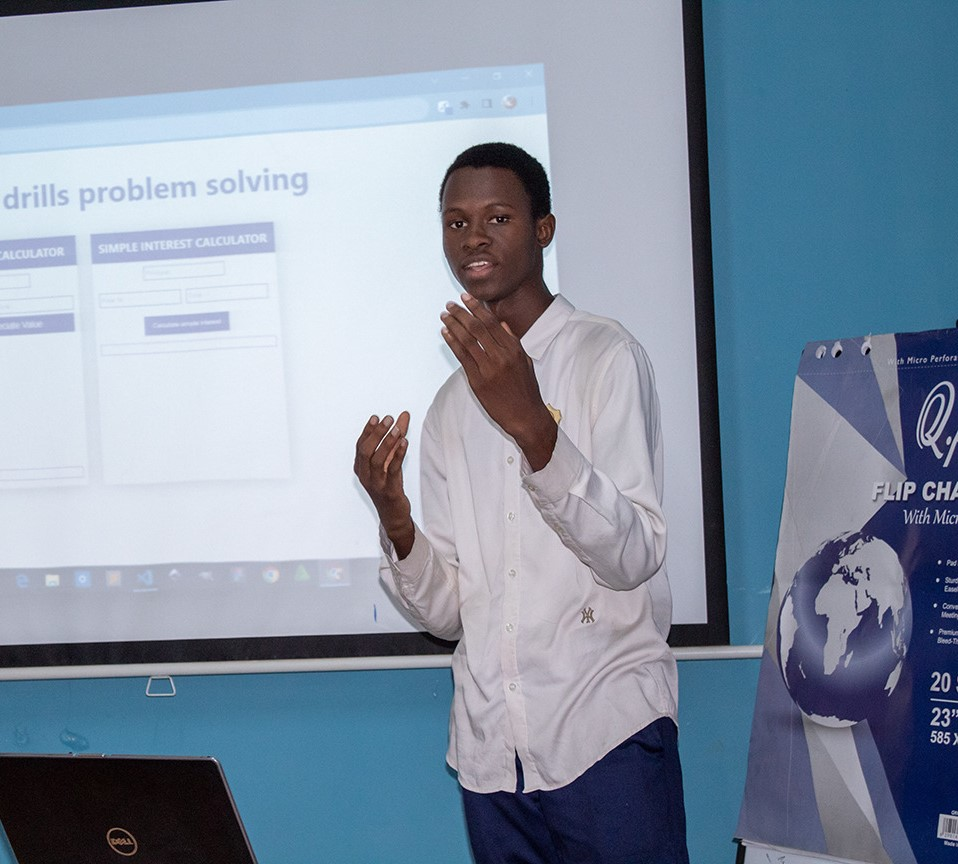

# Cherno B Jallow - Portfolio Website 

[](https://cbjtech.github.io/portfolio)
[](LICENSE)

> Personal portfolio website showcasing my journey as a Machine Learning Developer, Scientific Researcher, and Tech Educator from The Gambia.



## 🌟 About

This is my personal portfolio website where I share my work in AI/ML, research publications, speaking engagements, and community initiatives. Built with modern web technologies and designed to inspire young Africans in tech.

## ✨ Features

- **Interactive Hero Section** with Vanta.js globe animation
- **Dynamic Typing Animation** showcasing multiple roles
- **Responsive Design** - fully optimized for mobile, tablet, and desktop
- **Animated Hamburger Menu** with smooth transitions
- **Project Portfolio** with hover effects
- **Contact Form** integrated with EmailJS
- **Smooth Scrolling** navigation
- **Professional Timeline** of experience
- **Skills Visualization** with progress bars

## 🛠️ Technologies Used

- **Frontend**: HTML5, CSS3, JavaScript
- **Styling**: Tailwind CSS
- **Icons**: Feather Icons
- **Animations**: Vanta.js (Globe effect)
- **Form Service**: EmailJS
- **Deployment**: GitHub Pages

## 🚀 Quick Start

### Prerequisites
- A modern web browser
- Git installed on your machine

### Installation

1. Clone the repository
```bash
git clone https://github.com/YOUR_USERNAME/YOUR_REPO_NAME.git
cd YOUR_REPO_NAME

# If you have VS Code Live Server extension
# Right-click on index.html and select "Open with Live Server"

# Or open directly
open index.html  # macOS
start index.html # Windows

portfolio/
├── index.html          # Main HTML file
├── style.css           # Custom styles
├── main.js             # JavaScript functionality
├── images/             # Images and assets
│   ├── secondOne.jpeg
│   ├── best.jpeg
│   ├── true-13.pdf
│   └── ...
└── static/
    └── favicon.ico
